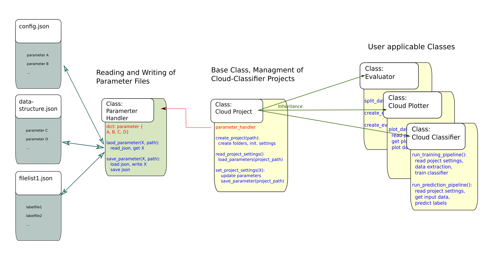

# Cloud Typing Tool

This Project aims to provide a number of tools that allow the application of machine learning frameworks for  cloud type determination from satelite data. It facilitates the extraction and preparation of data from NETCDF files containing satelite data, the training of classifiers on that data

## Architecture

## Project Parameters

### From 'config.json'

   **"classifier_type":** * "Forest" *    &rarr; Type of Classifier, "Forest" for Random Forest, "Tree" for Decision Tree.

   **"max_depth":** *35*     &rarr; Maximal depth of Decision Tree or Trees in Random Forest.

   **"ccp_alpha":** *0*    &rarr; Complexity parameter used for Minimal Cost-Complexity Pruning. The subtree with the largest cost complexity that is smaller than ccp_alpha will be chosen. By default, no pruning is performed.

   **"n_estimators":** *100*  &rarr; Number of Trees for the Random Forest Classifier.

   **"max_features":** *null*   &rarr; The number of features to consider when looking for the best split in the Random Forest Classifier. If None, all features will be used on every split.

   **"min_samples_split":** *2*  &rarr; The minimum number of samples required to split an internal node. 

   **"merge_list":** *[]* &rarr; List of tuples of names of cloud types that are merged into one during training and predicition. I.e. [["very low", "low"], ["semi. mod. thick", "semi. thick"]] would  treat all clouds defined as "very low" as "low" and all clouds defined as "semi. mod. thick" as "semi. thick". Reduces complexity of problem space and can increase prediction performance at the cost acuity.

   **"difference_vectors":** *true* &rarr; Determines if difference vectors are created from the original data points by pairwise subtraction of values. 

   **"original_values":** *true*    &rarr; Determines if the original data values are kept when difference vectors are created, or only the processed data points are used.

   **"samples":** *100*   &rarr; Number of samples that are taken from each file in the training set in order to train the classifier.

### From 'data_strucutre.json'

   **"data_source_folder":** *"../data/full_dataset"* &rarr; Path to the folder containg the training data. 

   **"timestamp_length":** *13* &rarr; Lenght of the timestamp in the filenames of satelite and label data.

   **"sat_file_structure":** * "msevi-medi-TIMESTAMP.nc" * &rarr; Name pattern of satelite data files.

   **"label_file_structure":** *"nwcsaf_msevi-medi-TIMESTAMP.nc" * &rarr; Name pattern of label data files.

   **"input_source_folder":** *"../data/example_data" * &rarr; Path to the folder containg the satelite data to use as input for label predicition. 

   **"georef_file":** *"../data/auxilary_files/msevi-medi-georef.nc" * &rarr; Path to georef file.

   **"mask_file":** *"../data/auxilary_files/lsm_mask_medi.nc" * &rarr; Path to mask file.

   **"mask_key":** *"land_sea_mask"* &rarr; Key of mask from mask file.

   **"mask_sea_coding":** *0* &rarr; Number coding for sea area in mask.

   **"input_channels":** *[
       "bt062",
       "bt073",
       "bt087",
       "bt097",
       "bt108",
       "bt120",
       "bt134"
   ] * &rarr; Channels that are read from the satelite data to create data vectors.

   **"cloudtype_channel":** *"ct"* &rarr; Key for the cloud type channel in the label data.

   **"nwcsaf_in_version":** *"auto"* &rarr; NWCSAF version of the input data. "v2013" for old standard, "v2018" for new standard, "auto" for automatic detection.

   **"nwcsaf_out_version":** *"v2018"* &rarr; NWCSAF version of the predicted labels. "v2013" for old NWCSAF standard, "v2018" for new standard.

   **"hours":** *[
        0
    ] * &rarr; Hours from which data is read  during training.
