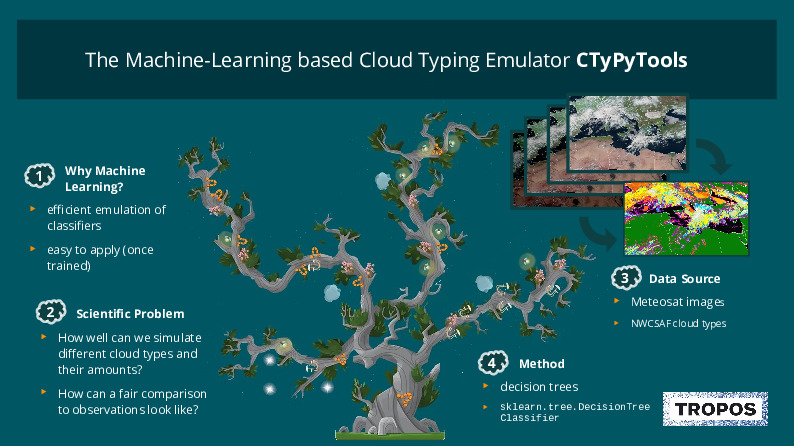

# CTyPyTool: Cloud Typing Python Tool

This tools is intended to help weather forecasters in assessing the quality of their cloud forecasts. 

**A few facts:**
* It emulates a cloud typing methodology (see https://www.nwcsaf.org/ct2) applied to Meteosat data (see https://www.eumetsat.int/meteosat-second-generation).
* It uses standard machine learning techniques, e.g. tree & random forest classifier
* It can be applied to so-called synthetic satellite data (observsation-equivalents derived from numerical forecast data).

**Schematic**




## Installation 

### On your Local Computer

#### Cloning repository
Use the following command to clone the project to your local machine.
```
$ git clone https://github.com/fsenf/CTyPyTool
```

#### Installing Dependencies:
This project comes with a Pipfile specifying all project dependencies.
When using `pipenv` first move into the project folder with:
```
$ cd cloud_classification

```
and then use the following command to install all necesarry dependencies into your virtual environment
```
$ pipenv install

```

### On the DKRZ Servers

See [here](docs/Running_Notebooks_on_DKRZ_JupyterHub.md) to get started with `CTyPyTools` on the DKRZ Super computer.


## Getting Started
There are severeal Jupyter Notebooks explaining the basic steps for training and applying the cloud classifier.

For using an already trained classifier check out [this notebook](notebooks/Application_of_a_pretrained_classifier.ipynb)

## Contributing

Your Contribution is very welcome! Yo could either contribute with:

* providing pre-trained classifiers for a specifically defined geographical region or for certain sessions
* reporting issues, missing features or bugs
* improving code

**4 Steps for source code developers**:
1. fork the `devel` branch
2. update source code / software parts in your fork
3. check functionality with example notebooks
4. make a pull request onto the `devel` branch in the "official" repository under https://github.com/fsenf/CTyPyTool
