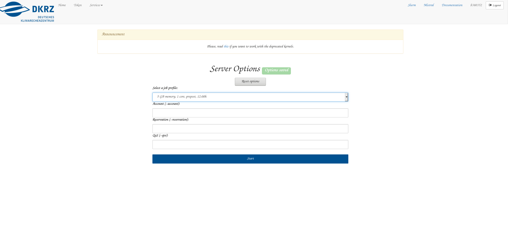

# Using Cloud Classification Tools on JuypterHub

This description is developed for the application of our cloud classification tool on DKRZ JupyterHub. However, it should be applicable for other jupyterhub serivces with minor changes.


## Login into JupyterHub

* First, you need to log into JupyterHub following the link https://jupyterhub.dkrz.de and enter your account details.

    

* Second, you select a preset. I like the 5 GB, prepost setting.
    
    

* Third, you open a terminal in your JuypterHub session (alternatively, you could login via `ssh` and use the ssh-terminal session)

    


## Installation of Cloud Classification Software and Its Dependencies

* Select a project location `<cloud_type_project_directory>`. You might need to create a new one!
    ```
    > cd <cloud_type_project_directory>
    ```
* **Get the git repository** (using `git clone`)

    ```
    > git clone https://github.com/rudegrass/cloud_classification.git
    Cloning into 'cloud_classification'...
    remote: Enumerating objects: 483, done.
    remote: Counting objects: 100% (483/483), done.
    remote: Compressing objects: 100% (294/294), done.
    remote: Total 483 (delta 241), reused 409 (delta 167), pack-reused 0
    Receiving objects: 100% (483/483), 11.21 MiB | 19.20 MiB/s, done.
    Resolving deltas: 100% (241/241), done.``` 
    ``` 
    Perfect! The source is there!
    
* **Temporary Step-Back as Bugfix**: The considered Notebooks run with a certain version of the software. We step back to this version. For newer version, bugfixes need to be implemented first.

    ```
    git checkout  a031547941e05c5da3e449123cc8a -B step-back
    ```
    Thus, we go back in history, check out a certain commit (starting with `a031 ...` and then give this a new branch name `step-back`)

* **Install dependencies**

    * The `PipFile` only names `numpy` & `request` as dependencies, see

        ```
         > cat Pipfile
        ...

        [packages]
        requests = "*"
        numpy = "*"

        [dev-packages]

        [requires]
        python_version = "3.8"
        ``` 
        
        Both might be part of the standard anaconda env. We ignore the dependencies, here.
       

## Run Test Cases with a Pretrained Classifier

### Download Data and Classifier

* go to classication tool directory and make a download folder

    ```
    cd cloud_classification
    mkdir download
    cd download
    ```

* start the download of zips with (command generate by swiftbrowser)

    ```
    wget -r -H -N --cut-dirs=3 --content-disposition -I "/v1/" "https://swiftbrowser.dkrz.de/tcl_objects/2022-05-01T09:29:56Z/r_db907a4d5abc7b6fba06b617ffc39153e1e7b80f/w_c44c1a86d8898dda37bdd760bc340eb62292bd24/dkrz_d7550ef1-c227-4463-a6a7-29c14dc05fde/cloud_typing_project/0/classifier/?show_all"
    ```

    The `*zip` Files contain pretrained classifiers.
    
* let us extract the tree classifier

    ```
    > unzip -d ../classifiers tree.zip
    Archive:  tree.zip
       creating: ../classifiers/TreeClassifier/
       creating: ../classifiers/TreeClassifier/data/
      inflating: ../classifiers/TreeClassifier/data/classifier
      inflating: ../classifiers/TreeClassifier/data/training_data
      inflating: ../classifiers/TreeClassifier/data/label_reference.nc
       creating: ../classifiers/TreeClassifier/labels/
       creating: ../classifiers/TreeClassifier/settings/
      inflating: ../classifiers/TreeClassifier/settings/data_structure.json
      inflating: ../classifiers/TreeClassifier/settings/config.json
       creating: ../classifiers/TreeClassifier/filelists/
      inflating: ../classifiers/TreeClassifier/filelists/evaluation_sets.json
      inflating: ../classifiers/TreeClassifier/filelists/training_sets.json
      inflating: ../classifiers/TreeClassifier/filelists/label_files.json
      inflating: ../classifiers/TreeClassifier/filelists/input_files.json
    ``` 
    Nice!
    
* Copy NWCSAF & Meteosat Data & Georef
    * Prepare data structure:
        ```
        > cd ..
        > mkdir -p data/prediction_data
        > mkdir -p data/training_data
        ```
        
    * Get Georef:

        ```
        > cp ~/data/meteosat-seviri/subregions/medi/lsm_mask_medi.nc data/training_data
        ```
        
    * Get Meteosat & NWCSAF Data: We copy data from the local directory (TODO: From swiftbrowser would be much more elegant!).
    
        ```
        > cp ~/data/meteosat-seviri/subregions/medi/*msevi-medi-20190318_1100.nc data/prediction_data
        > cp ~/data/meteosat-seviri/subregions/medi/*msevi-medi-20190317_1800.nc data/prediction_data
        ```
        
        Now, the data tree looks like:
        
        ```
        > tree data/
        data/
        ├── prediction_data
        │   ├── msevi-medi-20190317_1800.nc
        │   ├── msevi-medi-20190318_1100.nc
        │   ├── nwcsaf_msevi-medi-20190317_1800.nc
        │   └── nwcsaf_msevi-medi-20190318_1100.nc
        └── training_data
            └── lsm_mask_medi.nc

        2 directories, 5 files

        ```
### Run The Tests
* Notebook `Application_of_a_pretrained_classifier.ipynb`
    * go to the JupyterHub browser tab and navigate to the `notebooks` directory
    * open the notebook `Application_of_a_pretrained_classifier.ipynb` and chosen a Python kernel (the default would be `python3/unstable`)
         
    * finally run the notebook and watch out for errors!

    
---
