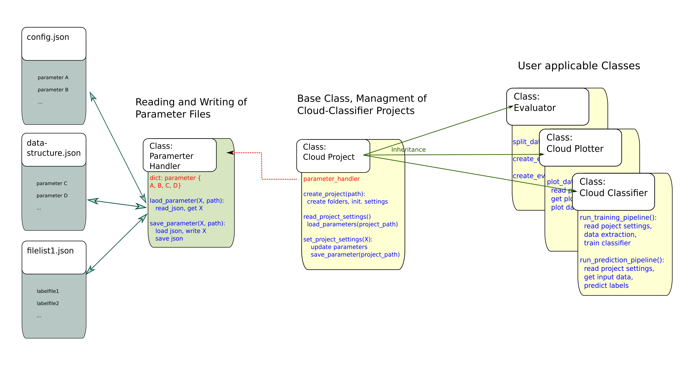

# Cloud Typing Tool: *CTyPyTool*

## Mission Statement
This project aims to provide an easy-to-use python interface 
- to train an emulator for satellite-based cloud classifications
- to apply machine learning frameworks for the emulation of a cloud classifcation result 

The *CTyPyTool* facilitates  
- the extraction and preparation of data from netCDF files containing input satellite data and cloud classification labels for training
- the training or retraining of differently confgured classifiers on that data
- the application of a pre-trained classifier to observed or synthetic satellite data.

Our niche:
- The *CTyPyTool* is mainly meant for research purposes in the field of atmospheric research. 
- The *CTyPyTool* is NOT meant to replace existing and much more sophistcated cloud typing algorithms.
- The *CTyPyTool* works by purpose with a reduced information content and thus allows to easily investigate how information is utilized in deriving a cloud typing product.
- The *CTyPyTool* is especially developed for the application of a consistent cloud classification method to observed and simulated satellite data where a satellite simulator / forward operator needs to be applied in advance to allow a one-to-one comparison.  

## Architecture

## Project Parameters

A number of project parameters determine 
- the way data is extracted from netCDF files as well as
- how a classifier is trained. 

When a new cloud classifier project is created, setting files are created in the project folder and initialized with default values. For further details see:
- [What happens during Setup?](devdocs-setup.md)
- [What happens if you create a new project?](devdocs-overview.md)

Listed below are all project settings currently used by the tool, their default values, and a short explanation about their usage.

### From 'config.json'

   **"classifier_type":** * "Forest" *    &rarr; Type of Classifier, "Forest" for Random Forest, "Tree" for Decision Tree.

   **"max_depth":** *35*     &rarr; Maximal depth of Decision Tree or Trees in Random Forest.

   **"ccp_alpha":** *0*    &rarr; Complexity parameter used for Minimal Cost-Complexity Pruning. The sub-tree with the largest cost complexity that is smaller than ccp_alpha will be chosen. By default, no pruning is performed.

   **"n_estimators":** *100*  &rarr; Number of Trees for the Random Forest Classifier.

   **"max_features":** *null*   &rarr; The number of features to consider when looking for the best split in the Random Forest Classifier. If None, all features will be used on every split.

   **"min_samples_split":** *2*  &rarr; The minimum number of samples required to split an internal node. 

   **"merge_list":** *[]* &rarr; List of tuples of names of cloud types that are merged into one during training and prediction. I.e. [["very low", "low"], ["semi. mod. thick", "semi. thick"]] would  treat all clouds defined as "very low" as "low" and all clouds defined as "semi. mod. thick" as "semi. thick". Reduces complexity of problem space and can increase prediction performance at the cost acuity.

   **"difference_vectors":** *true* &rarr; Determines if difference vectors are created from the original data points by pairwise subtraction of values. 

   **"original_values":** *true*    &rarr; Determines if the original data values are kept when difference vectors are created, or only the processed data points are used.

   **"samples":** *100*   &rarr; Number of samples that are taken from each file in the training set in order to train the classifier.

### From 'data_strucutre.json'

   **"data_source_folder":** *"../data/full_dataset"* &rarr; Path to the folder containing the training data. 

   **"timestamp_length":** *13* &rarr; Length of the timestamp in the filenames of satellite and label data.

   **"sat_file_structure":** * "msevi-medi-TIMESTAMP.nc" * &rarr; Name pattern of satellite data files.

   **"label_file_structure":** *"nwcsaf_msevi-medi-TIMESTAMP.nc" * &rarr; Name pattern of label data files.

   **"input_source_folder":** *"../data/example_data" * &rarr; Path to the folder containing the satellite data to use as input for label prediction. 

   **"georef_file":** *"../data/auxilary_files/msevi-medi-georef.nc" * &rarr; Path to georef file.

   **"mask_file":** *"../data/auxilary_files/lsm_mask_medi.nc" * &rarr; Path to mask file.

   **"mask_key":** *"land_sea_mask"* &rarr; Key of mask from mask file.

   **"mask_sea_coding":** *0* &rarr; Number coding for sea area in mask.

   **"input_channels":** *[
       "bt062",
       "bt073",
       "bt087",
       "bt097",
       "bt108",
       "bt120",
       "bt134"
   ] * &rarr; Channels that are read from the satellite data to create data vectors.

   **"cloudtype_channel":** *"ct"* &rarr; Key for the cloud type channel in the label data.

   **"nwcsaf_in_version":** *"auto"* &rarr; NWCSAF version of the input data. "v2013" for old standard, "v2018" for new standard, "auto" for automatic detection.

   **"nwcsaf_out_version":** *"v2018"* &rarr; NWCSAF version of the predicted labels. "v2013" for old NWCSAF standard, "v2018" for new standard.

   **"hours":** *[
        0
    ] * &rarr; Hours from which data is read  during training.
